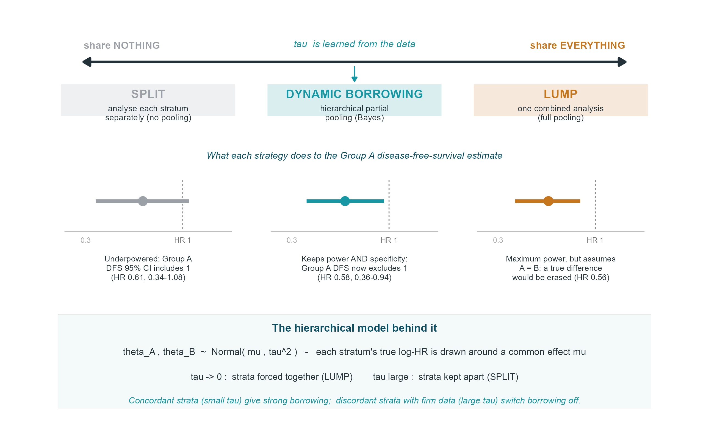

# ALASCCA — Bayesian dynamic borrowing across molecular strata

Reproducible code for a hierarchical Bayesian re-analysis of the two prespecified
molecular strata of the ALASCCA trial (adjuvant low-dose aspirin in PI3K-altered
colorectal cancer; Martling et al., *N Engl J Med* 2025;393:1051–1064).

The analysis uses **only the published summary-level subgroup hazard ratios and
their 95% confidence intervals** — no individual patient data — so every number
and figure can be reproduced directly from the trial report.

## Background

ALASCCA analysed two disjoint molecular strata separately: **group A**
(*PIK3CA* exon 9/20 hotspot mutations) and **group B** (other moderate/high-impact
variants in *PIK3CA*, *PIK3R1* or *PTEN*). The two strata gave concordant effects,
but the group-A disease-free-survival estimate was not statistically significant
in isolation (HR 0.61, 95% CI 0.34–1.08). Analysing strata separately protects
against biological noise but loses power; pooling them recovers power but assumes
the strata are identical.

This code implements a third option, **dynamic borrowing** (hierarchical partial
pooling), in which each stratum borrows strength from the other in proportion to
their observed concordance:

```
y_i      ~ Normal(theta_i, se_i^2)     # observed log-HR of stratum i
theta_i  ~ Normal(mu, tau^2)           # borrowing layer, i = A, B
mu       ~ vague ; tau ~ Half-Normal(0.5)
```

The between-stratum heterogeneity `tau` is learned from the data and governs how
much borrowing occurs: small `tau` → strata share strength; large `tau` → strata
are kept apart.

## Repository layout

```
R/
  01_analysis.R          estimates, posterior probabilities, tau-prior sensitivity
  02_figures.R           Figure 2 (forest) and Figure 3 (data-driven borrowing)
  03_figure_concept.R    Figure 1 (teaching schematic)
figures/                 generated figures (PNG, 300 dpi)
results/                 generated tables (CSV)
```

## Requirements

- R ≥ 4.3
- Packages: `bayesmeta`, `ggplot2`, `patchwork`, `dplyr`

```r
install.packages(c("bayesmeta", "ggplot2", "patchwork", "dplyr"))
```

Results below were produced with R 4.3.2 and `bayesmeta` 3.5, `ggplot2` 4.0.0,
`patchwork` 1.3.2, `dplyr` 1.1.4.

## How to reproduce

Run from the repository root:

```sh
Rscript R/01_analysis.R          # writes results/results_table.csv, results/tau_sensitivity.csv
Rscript R/02_figures.R           # writes figures/fig2_forest.png, figures/fig3_dynamic.png
Rscript R/03_figure_concept.R    # writes figures/fig1_concept.png
```

Each script is self-contained and re-derives its inputs from the published
hazard ratios.

## Key result

Borrowing strength from the concordant group B shifts the group-A
disease-free-survival estimate from HR 0.61 (0.34–1.08), which includes no effect,
to HR 0.58 (95% credible interval 0.36–0.94), which excludes it; the posterior
probability of benefit rises from 95.3% to 98.7%. The shared effect is robust to
the `tau` prior, and a sensitivity sweep (`02_figures.R`, Figure 3) shows that
borrowing switches off automatically when strata genuinely diverge with precise
data.



## Data source

All inputs are the published ALASCCA subgroup results:

> Martling A, Hed Myrberg I, Nilbert M, et al. Low-dose aspirin for PI3K-altered
> localized colorectal cancer. *N Engl J Med.* 2025;393(11):1051–1064.

## Citation

This code accompanies a methodological brief article (submitted):

> Carmona-Bayonas A. Filtering noise without sacrificing power: Bayesian dynamic
> borrowing across the molecular strata of the ALASCCA aspirin trial.

## License

Released under the MIT License (see `LICENSE`).
